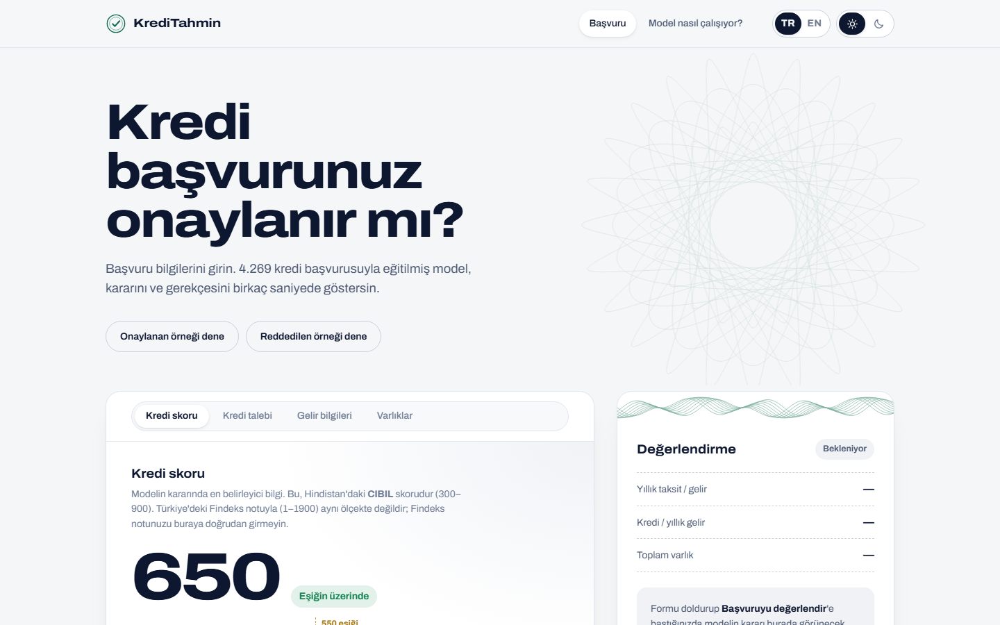
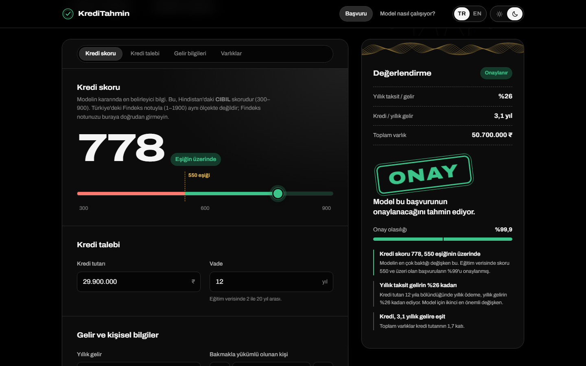
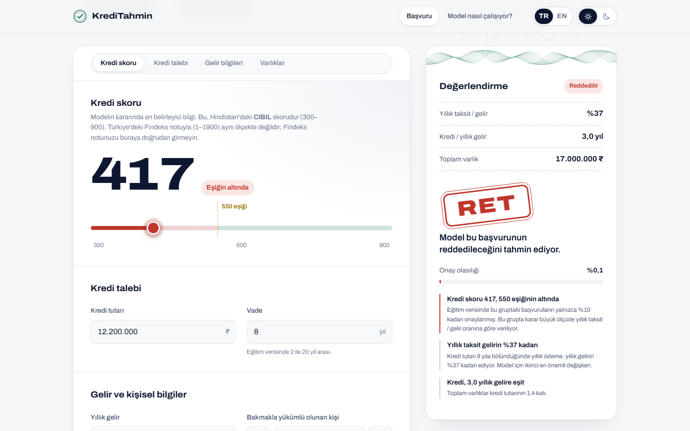
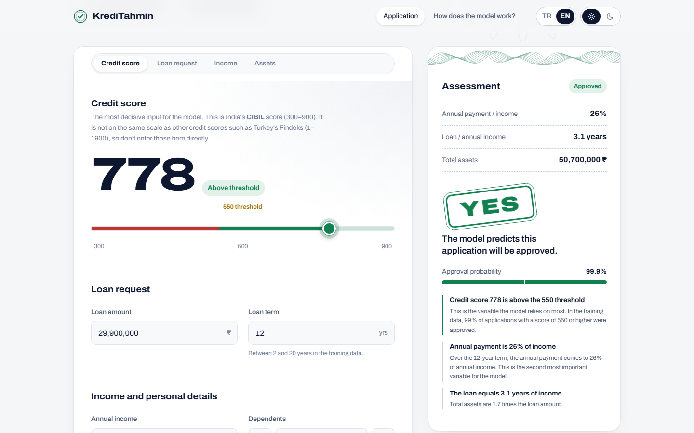
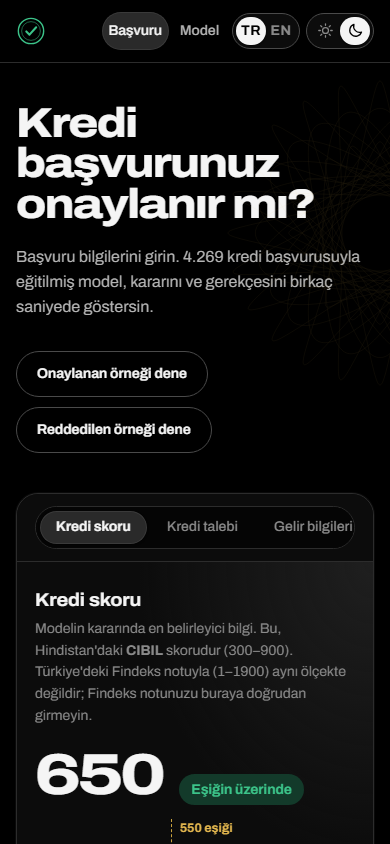
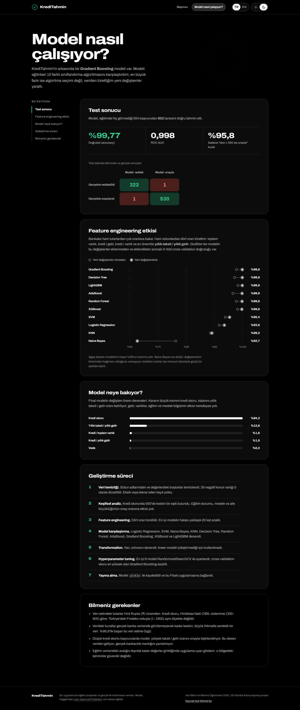

# KrediTahmin

**Türkçe** | [English](README.en.md)

[](https://github.com/GeneralBuSa/kreditahmin/actions/workflows/test.yml)

Kredi başvurusunun onaylanıp onaylanmayacağını tahmin eden bir makine öğrenmesi web uygulaması. Kullanıcı başvuru bilgilerini girer; model kararı, onay olasılığını ve kararın gerekçesini gösterir.

**Canlı site:** [generalbusa.github.io/kreditahmin](https://generalbusa.github.io/kreditahmin/) · [English](https://generalbusa.github.io/kreditahmin/en/)

**Veri Bilimi ve Makine Öğrenmesi 2026: 100 Günlük Kamp** kapanış projesidir.



## Özellikler

- **Tahmin ve gerekçe:** Onay kararı, onay olasılığı ve kararı en çok etkileyen değişkenlerin açıklaması.
- **Bölüm menüleri (scrollspy):** Ana sayfadaki formun üstünde adım şeridi (Kredi skoru, Kredi talebi, Gelir, Varlıklar), "Model nasıl çalışıyor?" sayfasında içindekiler menüsü var; kaydırdıkça bulunulan bölüm vurgulanır.
- **Uyarılar:** Eğitim verisinin dışında kalan değerler girildiğinde tahminin güvenilir olmayabileceği söylenir.
- **Türkçe ve İngilizce:** Türkçe sayfalar `/` ve `/model`, İngilizce sayfalar `/en/` ve `/en/model` adresindedir. Dil, sağ üstteki **TR | EN** anahtarıyla değiştirilir.
- **Açık ve karanlık tema:** İlk açılışta işletim sisteminin ayarı kullanılır; sağ üstteki anahtarla değiştirilebilir ve seçim tarayıcıda hatırlanır.
- **Sunucusuz sürüm:** GitHub Pages sürümünde model tarayıcıda çalışır; sonuçlar scikit-learn ile birebir aynıdır.
- **Mobil uyumlu**, klavye ve ekran okuyucuyla kullanılabilir, "hareketi azalt" ayarına uyar.

## Sonuçlar

| | |
|---|---|
| Final model | Gradient Boosting |
| Test accuracy | **%99,77** (854 başvurudan 852'si doğru) |
| ROC AUC | 0,998 |
| Baseline ("kredi skoru ≥ 550 ise onayla" kuralı) | %95,8 |

Projede 10 sınıflandırma algoritması karşılaştırıldı. En büyük kazanç model seçiminden değil **feature engineering**'den geldi: veriden türetilen *yıllık taksit / yıllık gelir* oranı, en iyi modelin hatasını yaklaşık 20 kat azalttı.

| Model | Feature engineering öncesi | Sonrası |
|---|---|---|
| Gradient Boosting | %97,8 | **%99,9** |
| Decision Tree | %97,2 | %99,9 |
| LightGBM | %98,4 | %99,9 |
| AdaBoost | %96,6 | %99,9 |
| Random Forest | %97,8 | %99,8 |
| XGBoost | %98,2 | %99,8 |
| SVM | %93,9 | %95,4 |
| Logistic Regression | %91,7 | %93,6 |
| KNN | %88,6 | %89,2 |
| Naive Bayes | %76,3 | %62,7 |

*(5-fold cross validation accuracy, train verisi üzerinde)*

## Proje adımları

1. **Veri temizliği:** Sütun adlarındaki ve değerlerdeki boşluklar temizlendi; 28 negatif konut varlığı değeri 0 yapıldı.
2. **EDA:** Kredi skorunda 550'de keskin bir eşik bulundu. Eğitim durumu, meslek ve aile büyüklüğünün onaya etkisi yok.
3. **Feature engineering:** Toplam varlık, kredi / gelir, kredi / varlık ve yıllık taksit / gelir oranları türetildi.
4. **Model karşılaştırma:** Logistic Regression, SVM, Naive Bayes, KNN, Decision Tree, Random Forest, AdaBoost, Gradient Boosting, XGBoost, LightGBM.
5. **Transformation:** Yeo-Johnson denendi; lineer modeli iyileştirmediği için kullanılmadı.
6. **Hyperparameter tuning:** 6 model RandomizedSearchCV ile ayarlandı.
7. **Yayına alma:** Model `pickle` ile kaydedildi ve Flask uygulamasına bağlandı.

Tüm analiz [`notebooks/loan_approval_training.ipynb`](notebooks/loan_approval_training.ipynb) dosyasında.

## Ekran görüntüleri

| Karanlık tema: onaylanan başvuru | Açık tema: reddedilen başvuru |
|---|---|
|  |  |

| İngilizce sürüm | Mobil görünüm |
|---|---|
|  |  |

<details>
<summary>"Model nasıl çalışıyor?" sayfası (tam sayfa)</summary>



</details>

## Kurulum ve çalıştırma

Python 3.12 veya üstü gerekir (`numpy` 2.5, Python 3.11'i desteklemiyor). Önerilen sürüm `.python-version` dosyasındaki 3.13'tür.

```bash
git clone https://github.com/GeneralBuSa/kreditahmin.git
cd kreditahmin
python -m venv .venv
# Windows: .venv\Scripts\activate
# macOS / Linux: source .venv/bin/activate
pip install -r requirements.txt
python app.py
```

Tarayıcıda `http://127.0.0.1:5000` adresini açın. Windows'ta `localhost` yerine `127.0.0.1` yazın: `localhost` önce IPv6 adresini denediği için her istekte ~0,2 saniye gecikme olur.

Geliştirirken hata ayıklama modunu açın; kod değiştikçe sunucu kendini yeniden başlatır ve hata ayrıntıları görünür:

```bash
FLASK_DEBUG=1 python app.py
```

Windows PowerShell'de: `$env:FLASK_DEBUG=1; python app.py`. Güvenlik için bu mod varsayılan olarak kapalıdır; sunucuda açmayın.

**PyCharm'da:** Projeyi açın → *Settings → Python Interpreter* ile yeni bir virtualenv oluşturun → terminalde `pip install -r requirements.txt` → `app.py` dosyasına sağ tıklayıp *Run 'app'*.

### Ayarlar (ortam değişkenleri)

| Değişken | Ne işe yarar | Varsayılan |
|---|---|---|
| `FLASK_DEBUG` | `1` ise hata ayıklama modu açılır (`python app.py` ile çalıştırırken) | kapalı |
| `SITE_URL` | Paylaşım önizlemesindeki (Open Graph) tam adresler ve GitHub Pages'in 404 sayfası için sitenin adresi | Flask: isteğin adresi · Statik site: `https://generalbusa.github.io/kreditahmin` |

## Testler

```bash
pip install -r requirements-dev.txt
pytest
```

Testler şunları kontrol eder:

- **Tahmin:** API'nin doğru tahmin yaptığını; eksik alanları, `nan` / `inf` gibi değerleri ve çok büyük sayıları 400 hatasıyla reddettiğini.
- **GitHub Pages sürümü:** `docs/` klasörünün güncel olduğunu (başarısız olursa `python scripts/build_static.py` çalıştırın) ve tarayıcıda çalışan `predictor.js`'in Flask API'siyle iki dilde de aynı doğrulama kurallarını ve aynı sonuçları ürettiğini. Bu test için [Node.js](https://nodejs.org) gerekir; kurulu değilse atlanır.
- **Dil desteği:** İngilizce sayfalarda, API yanıtlarında ve JavaScript dosyalarında Türkçe metin kalmadığını; iki dilde aynı metin anahtarlarının bulunduğunu.
- **Güvenlik:** Güvenlik başlıklarını, sayfalarda satır içi script bulunmadığını, büyük isteklerin reddedildiğini ve hata sayfalarının kullanıcı girdisini sayfaya yansıtmadığını.

Her push'ta testler GitHub Actions'ta otomatik çalışır (`.github/workflows/test.yml`).

## Yayına alma

Projede sitenin iki sürümü var.

### 1. GitHub Pages (önerilen, ek hesap gerekmez)

`docs/` klasörü sitenin statik sürümüdür. Model `docs/model.json` dosyasından okunur ve tahmin **tarayıcıda** yapılır; sunucuya gerek yoktur ve site hiç uykuya geçmez.

1. Repoda **Settings → Pages** sayfasını açın (repo **public** olmalı).
2. *Source* olarak **Deploy from a branch** seçin; *Branch*: `main`, klasör: `/docs` → **Save**.
3. 1-2 dakika içinde site [generalbusa.github.io/kreditahmin](https://generalbusa.github.io/kreditahmin/) adresinde yayında olur.

Model, şablonlar, metinler, CSS veya JavaScript değiştiğinde statik sürümü yeniden üretin:

```bash
python scripts/build_static.py
```

Repo başka bir kullanıcı adı veya isimle yayınlanıyorsa build sırasında adresi verin: `SITE_URL=https://kullanici.github.io/repo python scripts/build_static.py`.

### 2. Render (Flask uygulamasının kendisi)

Repoda `render.yaml` ve `.python-version` dosyaları hazır.

1. [render.com](https://render.com) üzerinde GitHub hesabınızla oturum açın.
2. **New → Blueprint** seçip bu repoyu bağlayın; Render `render.yaml` dosyasını okuyup servisi kurar.
3. Kurulum bitince site `https://kreditahmin.onrender.com` benzeri bir adreste açılır.

Ücretsiz planda servis 15 dakika kullanılmazsa uyku moduna geçer; sonraki ilk açılış yaklaşık 1 dakika sürer.

## API

```bash
curl -X POST http://127.0.0.1:5000/api/predict \
  -H "Content-Type: application/json" \
  -d '{"cibil_score": 778, "loan_amount": 29900000, "loan_term": 12, "income_annum": 9600000,
       "no_of_dependents": 2, "education": "Graduate", "self_employed": "No",
       "residential_assets_value": 2400000, "commercial_assets_value": 17600000,
       "luxury_assets_value": 22700000, "bank_asset_value": 8000000}'
```

Başarılı yanıt; `approved`, `probability`, hesaplanan oranlar (`ratios`), kararın gerekçeleri (`factors`) ve eğitim aralığı dışındaki değerler için uyarılar (`warnings`) içerir.

- Yanıtı İngilizce almak için adrese `?lang=en` ekleyin (`/api/predict?lang=en`); varsayılan dil Türkçedir.
- Hatalı girdide **400** ve alan bazında mesajlar döner: `{"errors": {"cibil_score": "..."}}`.
- 16 KB'tan büyük istekler **413** ile reddedilir. Diğer hatalarda yanıt `{"error": "..."}` biçimindedir.

## Güvenlik

- **İçerik Güvenlik Politikası (CSP):** Script, stil, font ve görseller yalnızca sitenin kendisinden yüklenebilir; sayfalarda satır içi script yoktur. Flask sürümünde başlık olarak, GitHub Pages sürümünde `<meta>` etiketi olarak verilir.
- **Güvenlik başlıkları:** `X-Content-Type-Options`, `X-Frame-Options` (başka sitelerin sayfayı çerçeve içinde açması engellenir), `Referrer-Policy`, `Permissions-Policy`; HTTPS'te `Strict-Transport-Security`.
- **Girdi doğrulama:** Her alan türü ve aralığı için kontrol edilir; sayı olmayan, sonsuz veya aşırı büyük değerler reddedilir. Kullanıcı verisi sayfaya her zaman düz metin olarak yazılır.
- **Hata ayıklama modu** varsayılan olarak kapalıdır; hata sayfaları iç ayrıntı göstermez.
- Uygulama hesap, oturum, çerez veya veritabanı kullanmaz; girilen bilgiler saklanmaz.
- Bağımlılıklar [`pip-audit`](https://pypi.org/project/pip-audit/) ile tarandı; bilinen bir güvenlik açığı bulunmadı.

## Proje yapısı

```
kreditahmin/
├── app.py                  Flask uygulaması (sayfalar, /api/predict, güvenlik başlıkları)
├── requirements.txt        Uygulamanın bağımlılıkları (Render bunu kurar)
├── requirements-dev.txt    + test bağımlılıkları
├── render.yaml             Render ayarları
├── .github/workflows/      GitHub Actions: her push'ta testleri çalıştırır
├── docs/                   GitHub Pages için statik sürüm (scripts/build_static.py üretir)
├── scripts/build_static.py Modeli model.json'a aktarır, statik siteyi üretir
├── src/
│   ├── features.py         Feature engineering (notebook'takiyle aynı)
│   └── i18n.py             Sitenin tüm Türkçe ve İngilizce metinleri
├── model/
│   ├── loan_model.pkl      Eğitilmiş model + kategorik eşlemeler + sütun sırası
│   └── model_info.json     "Model nasıl çalışıyor?" sayfasındaki metrikler
├── notebooks/
│   └── loan_approval_training.ipynb   Veri analizi ve model eğitimi
├── templates/              HTML şablonları (Jinja): başvuru, model ve hata sayfaları
├── static/
│   ├── css/style.css       Tasarım (açık ve karanlık tema)
│   ├── js/                 boot.js (tema, metinler), app.js (form), theme.js (anahtarlar), scrollspy.js,
│   │                       predictor.js (GitHub Pages'te tarayıcıda çalışan model)
│   ├── img/                Guilloche desenleri ve paylaşım görseli (og-image.png)
│   └── fonts/              Archivo yazı tipi
├── tests/
│   ├── test_app.py         Testler
│   └── run_predictor.js    predictor.js'i Node'da çalıştırır (karşılaştırma testi için)
└── screenshots/
```

## Yeni metin eklemek

Kullanıcıya görünen tüm metinler [`src/i18n.py`](src/i18n.py) dosyasındadır; şablonlara ve JavaScript dosyalarına doğrudan metin yazılmaz. Yeni bir metin eklerken iki dile de ekleyin ve ardından `python scripts/build_static.py` çalıştırın. Bir dilde eksik kalan metni veya İngilizce sayfaya sızan Türkçeyi testler yakalar.

## Modeli yeniden eğitmek

Notebook Kaggle'da çalışacak şekilde yazıldı. Kaggle'da yeni bir notebook açıp bu dosyayı içe aktarın, **Add Input** ile [Loan Approval Prediction Dataset](https://www.kaggle.com/datasets/architsharma01/loan-approval-prediction-dataset) veri setini ekleyin ve çalıştırın. Çıkan `loan_model.pkl` ve `model_info.json` dosyalarını `model/` klasörüne koyun, ardından `python scripts/build_static.py` çalıştırın.

> Pickle dosyası, kaydedildiği scikit-learn sürümüyle yüklenmelidir. Modeli Kaggle'da yeniden eğitirseniz `requirements.txt` dosyasındaki `scikit-learn` sürümünü Kaggle'daki sürümle aynı yapın (`model_info.json` içindeki `sklearn_version` alanında yazar). Pickle dosyaları çalıştırılabilir kod içerebilir; yalnızca kendi ürettiğiniz model dosyalarını yükleyin.

## Bilinmesi gerekenler

- Bu bir eğitim projesidir ve gerçek bir kredi kararı vermez.
- Tutarlar Hint Rupisi (₹) cinsindendir. Kredi skoru Hindistan'daki CIBIL sistemine (300–900) göredir. Türkiye'deki Findeks notu (1–1900) farklı bir ölçektir ve iki sistem arasında resmi bir dönüşüm yoktur; Findeks notunu bu forma doğrudan girmeyin.
- Verideki kurallar gerçek banka verisinde görülemeyecek kadar keskin; veri büyük ihtimalle sentetiktir. %99,8'lik başarı bu veri setine özgüdür.
- Eğitim verisinin dışında kalan değerler girildiğinde uygulama uyarı gösterir.

## Kullanılan teknolojiler

Python, pandas, scikit-learn, XGBoost, LightGBM (model karşılaştırma), Flask, HTML/CSS/JavaScript (harici kütüphane yok). Sayfadaki guilloche desenleri banknot ve sertifikalardaki güvenlik baskısından esinlenerek Python ile üretildi. Yazı tipi: [Archivo](https://github.com/Omnibus-Type/Archivo) (SIL Open Font License).

## Lisans

[MIT](LICENSE)
